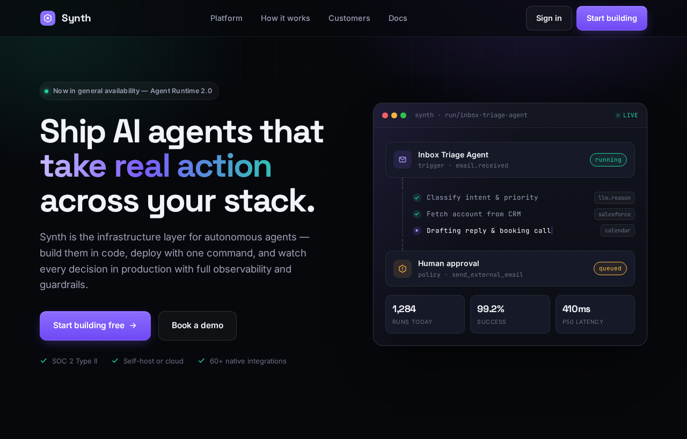
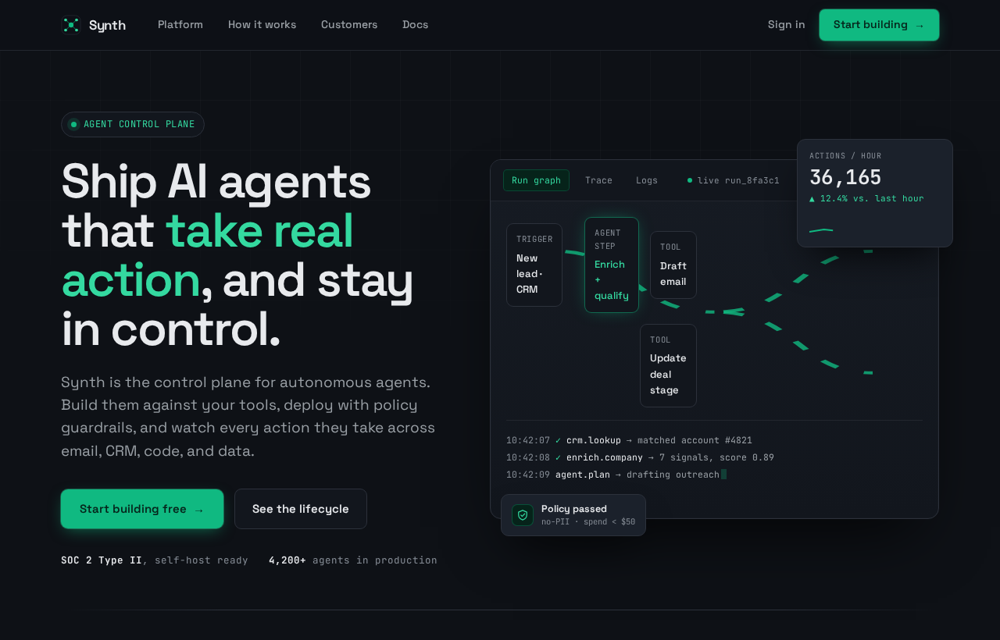
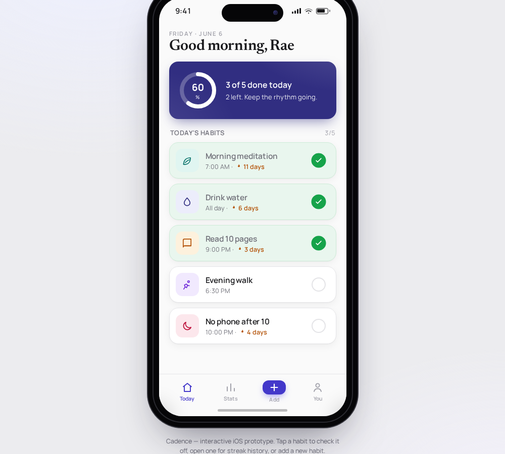
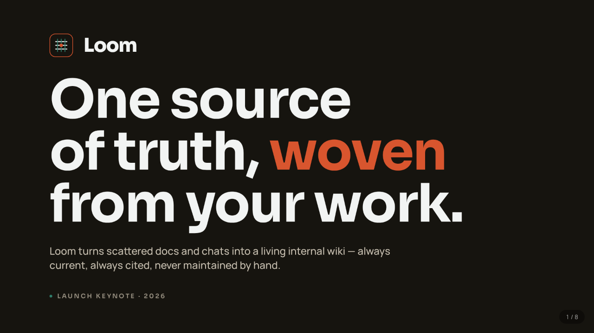
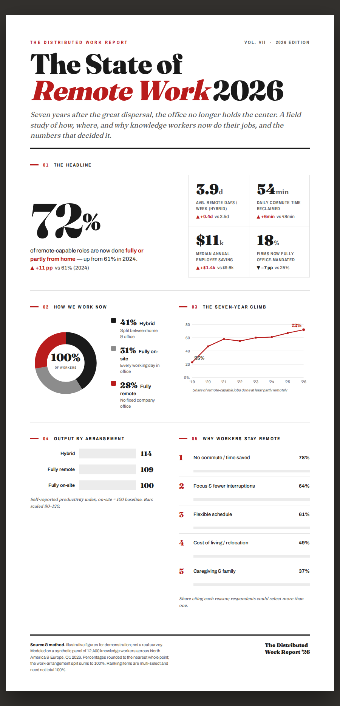

# atelier

**A repo-aware design studio that *governs* your design — it doesn't just generate pages.** Ships as a Claude Code plugin, a standalone CLI, and a multi-harness skill (Codex, Cursor, Gemini, Copilot, OpenCode, and more).

Most design tools (AI or otherwise) generate a pretty artifact and walk away.
atelier does the senior thing: it **measures** the design language already living
in your codebase, writes it down as an **enforceable contract** (`DESIGN.md` +
machine-readable tokens), and then makes every output — and every future change —
obey it. One bold, intentional aesthetic per project; never generic AI slop.
The axis atelier wins on: **measured from your code, contract-bound, qa-gated, and
governed over time** — not a one-shot prompt.

> The difference: pretty pages are table stakes. A design system that is
> *measured from your code, enforced in CI, audited for accessibility, and kept
> coherent over the product's lifetime* is the part a senior designer-engineer
> brings — and what atelier automates.

> **Status: pre-release (0.1.0).** Capabilities and script APIs may still change — see the [CHANGELOG](CHANGELOG.md).

## Install

In Claude Code, add the marketplace and install the plugin:

```text
/plugin marketplace add BrunoVini/atelier
/plugin install atelier@atelier-dev
```

Then just ask for design work in any repo — atelier triggers on prototypes,
pages, components, slides, animations, previews, variants, reviews, layout scores,
"weigh the options", or "make it look good". The Python scripts use the stdlib
(no install needed); `screenshot.mjs` / `diff_screens.mjs` / `responsive_check.mjs`
and video export are optional and need Node + a headless browser.

### Beyond Claude Code

atelier is authored once and builds for **Codex, Cursor, Gemini CLI, GitHub Copilot,
OpenCode, Kiro, Pi, Qoder, Trae, and Rovo Dev** from the same source. Build the tree
for your harness and copy it into your project (or your user-level config dir):

```text
python3 scripts/build_dist.py --harness all       # all harnesses into dist/
python3 scripts/build_dist.py --harness codex      # just one
```

Each harness gets atelier installed at its native skill path (e.g. `.cursor/skills/`,
`.gemini/skills/`, `.github/skills/`), so the skill triggers on the same design
requests as on Claude Code — just ask for the work in natural language.

The seven commands (`design-md`, `check`, `review`, `refine`, `preview`, `variants`,
`migrate`) are ported into each harness's own command system where one exists — Codex
custom prompts, Cursor commands, Gemini TOML commands, Copilot prompt files, OpenCode
commands — so `/atelier-review` (or your harness's equivalent) works there too.
Harnesses without a command system (Kiro, Pi, Qoder, Trae, Rovo Dev) invoke atelier by
natural language instead.

The collision-gate hook that *forces* a re-check before an agent stops is
Claude-Code-only — a documented degradation. On every other harness the self-QA loop
(`python3 scripts/qa.py <artifact> --hook`) is the definition of done. See the
per-harness capability + degradation matrix in [HARNESSES.md](HARNESSES.md).

## What runs when you install

No surprises. Installing or cloning atelier runs **nothing**:

- **No install scripts, no postinstall, no telemetry, no network fetch.** atelier is
  authored as a skill — adding the plugin/marketplace or cloning the repo copies files;
  it does not execute anything. Nothing phones home, ever.
- **Stdlib-only / Node-builtins-only.** The Python scripts use only the standard
  library; the optional `.mjs` helpers use only Node built-ins (plus a headless
  browser you provide). There is nothing to `pip install` or `npm install` to use the
  core skill.
- **Scripts run only when explicitly invoked** — by you, or by the agent during a
  design task. None run on install or in the background.
- **The Claude-Code collision hook is the one thing the harness auto-runs**, and only
  on the Claude build. `hooks/hooks.json` registers `hooks/atelier-collision-gate.py`
  on `Stop` / `SubagentStop`: it re-checks the rendered output for layout collisions
  before an agent is allowed to finish, and **gates** (blocks the stop) if it finds
  one. It runs locally, reads files, and makes **no network calls**.
- **The hook ships only to the Claude build.** Other harnesses (Codex, Cursor, Gemini,
  Copilot, OpenCode, Kiro, Pi, Qoder, Trae, Rovo Dev) don't carry `hooks/` and can't be
  force-gated — they fall back to the `qa.py` self-QA loop. See the per-harness
  degradation matrix in
  [HARNESSES.md](HARNESSES.md).

## Commands

atelier triggers on natural language for everything; these slash commands are explicit
shortcuts into the highest-value workflows:

| Command | What it does |
|---|---|
| `/atelier:design-md` | Measure the repo and generate or refresh its `DESIGN.md` contract + tokens |
| `/atelier:check` | Run the deterministic design gate (drift + contrast + house-rules + overlap) |
| `/atelier:review` | Design review + layout score + self-QA on an artifact or repo (register-aware) |
| `/atelier:refine` | Apply a named refinement move (bolder / quieter / distill / harden / delight) |
| `/atelier:preview` | Open live mode — themed preview or injecting proxy over your dev server |
| `/atelier:variants` | Produce 2–3 distinct, on-contract design directions with content parity |
| `/atelier:migrate` | Token-migration codemod — rewrite hardcoded values to `var(--token)` |

### Standalone CLI — `atelier check`

You don't need the Claude Code skill to run atelier's deterministic design gate.
The `check` command ships as a tiny, **stdlib-only** CLI (zero runtime
dependencies) you can drop into any repo's CI or pre-commit:

```bash
# from a clone, no install (ephemeral):
uvx --from . atelier check path/to/your-repo

# install it on PATH:
pipx install .          # then:  atelier check path/to/your-repo

# no install at all — straight from the source tree:
python3 -m atelier check path/to/your-repo
```

`atelier check <path>` runs the same four deterministic gates the skill uses as a
merge gate, against a **local repo directory**:

- **design-lint** — colors / fonts / spacing / elevation that drift off the contract
- **contrast-audit** — WCAG AA contrast on the contract's color pairs
- **house-rules** — `DESIGN.md` §9 "do/don't" rules (e.g. "no flyouts, only modals")
- **overlap-risk** — static collision patterns (%-pinned absolutes, negative margins, …)

It needs a contract in the target: `design/design-tokens.json` **or** a `DESIGN.md`.
Exit codes: `0` pass, `1` gate failed, `2` usage / no-contract / missing path.
Forwarded flags: `--contract <json>`, `--max-drift N`, `--allow-contrast-fail`,
`--max-overlap-risk N`, `--ratchet`, `--update-baseline`. The command operates on
local paths only — it does **not** fetch URLs.

The PyPI distribution name is `atelier-design`; the import package and the command
are both `atelier`, so it's `atelier check …` either way.

## Gallery

Same brief, same model — **without atelier vs. with it.** The skill drops the generic-AI
defaults (violet gradient, Inter, decorative color) for an owned, self-QA'd system:

<table>
<tr>
<td width="50%"><br><sub>⟵ <b>without atelier</b> — violet/teal + Inter, decorative accent</sub></td>
<td width="50%"><br><sub><b>with atelier</b> ⟶ owned palette, characterful type, honest live UI, zero slop tells</sub></td>
</tr>
</table>

Each artifact below also came from a **one-line brief** — one self-contained file, run
through atelier's own self-QA loop (slop / contrast / overlap / a11y / progressive-enhancement)
and fixed until clean:

<table>
<tr>
<td width="50%"><br><sub><b>Clickable iOS prototype</b> — real iPhone frame, tap-navigable screens, boots offline.</sub></td>
<td width="50%"><br><sub><b>SVG illustration</b> — full-bleed hero with atmospheric depth and a lead-line to the focal point.</sub></td>
</tr>
<tr>
<td><br><sub><b>Keynote deck</b> — real slide engine + speaker notes; exports to <b>vector PDF</b> and <b>editable PPTX</b>.</sub></td>
<td><br><sub><b>Print infographic</b> — magazine type, hand-built SVG charts, data that reconciles; exports to PDF.</sub></td>
</tr>
</table>

## The core idea

Measure before you generate. The design already living in the repo wins over
anything invented from scratch. atelier works in three phases:

**MEASURE** the repo → **GENERATE** artifacts on-contract → **GOVERN** coherence over time.

And on *every* artifact — even from-scratch work with no repo to measure — it runs a
**self-QA loop and fixes what it flags** (slop, contrast, overlaps, overflow, and
progressive-enhancement — content must render without JavaScript). That mechanical
verification of its own output is the delta a blank model can't reproduce.

An optional **`register`** in the contract — `brand` or `product` — shifts what counts
as slop: decoration-cost tells (glassmorphism, oversized hero) gate hard on a *product*
surface, while generic / monotonous "safe" tells gate on a *brand* surface. The same gate,
tuned to what the surface is for.

## Everything atelier does

Three phases, one contract — measure first, generate on-contract, then keep it honest:

- **MEASURE** — extracts an empirical `DESIGN.md` from your code (colors by perceptual
  ΔE, fonts, spacing, breakpoints, stack), stays honest about messy repos, and can seed
  from a reference image or URL.
- **GENERATE** — prototypes, live mode over your running dev server, slides,
  animation/video, SVG, living style guides, responsive sweeps, named refinement moves
  (bolder / quieter / distill / harden / delight), and multi-brand / dark-mode / native
  theming — all bound to the contract.
- **GOVERN** — slop detector (including the second-order "predictable safe choice" tell),
  WCAG contrast audit, overlap hunting, design lint, defensive-CSS rules, quantified
  design laws, house-rule enforcement, token-migration codemod, a 0–100 coherence score,
  and CI / PR gates.

<details>
<summary><b>Full capability list</b></summary>

### MEASURE — understand the repo's real design first

- **Empirical DESIGN.md contract.** Clusters the real colors in your code
  (perceptual ΔE — incl. `oklch`/`lab`/`color-mix`), reads your fonts, spacing,
  radius, breakpoints, framework, and component library — from stylesheets,
  Tailwind classes / `tailwind.config` / **Tailwind v4 `@theme`**, `theme.ts`,
  CSS-in-JS, design-token custom properties, and across a **monorepo** — and
  writes a contract grounded in fact, not guesswork.
- **Honest about messes.** Grades a repo's consistency first; a coherent repo is
  auto-mapped, a chaotic one gets a per-dimension warning with the best options
  pre-selected for you to choose — it never writes a confident contract over chaos.
- **Thin contract when the repo owns its tokens.** When a TS theme / CSS-vars /
  Tailwind config already exists, DESIGN.md *points at it* instead of duplicating
  values (a second copy silently drifts).
- **Reference import (image or URL).** "Make it like this" — extracts colors, type,
  and spacing from a screenshot or a live site to seed a direction.
- **Frontend architecture survey + component census.** Maps the stack and catalogs
  your components/variants so output *reuses* them instead of reinventing.
- **Knowledge-grounded recommendations.** Palette, typography, named-style, product,
  and stack-idiomatic (react/next/shadcn/swiftui/flutter/rn) guidance — used to fill
  gaps when the scan is sparse, and for cold-start reasoning on greenfield work.

### GENERATE — produce artifacts that obey the contract

- **Hi-fi prototypes / app mockups / device frames**, real UI code written into an
  existing repo, and **2–3 distinct design directions** to choose from.
- **Named refinement moves** — *bolder / quieter* (intensity ±), *distill*, *harden* (the
  empty / loading / error / long-content states), and one earned *delight*. Register-aware
  and bound to the design laws, so "make it pop" or "tone it down" is a contract-safe move,
  not a free-for-all.
- **Landing / marketing-page craft** — an owned aesthetic over the genre default, a real
  focal moment with depth, a production **type-engineering floor** (fluid `clamp()` scale,
  tabular/slashed-zero numerals, balanced rag, a metric-matched fallback so the body stays
  characterful offline), and **honest proof only** (no fabricated logo walls, testimonials,
  or scale-theater stats).
- **Live mode** — two ways in. A themed local server serves a standalone artifact under
  your own tokens with click-to-select; or, when you point it at your **running Vite / Next
  dev server**, an overlay-injecting **reverse proxy** lets you pick an element and slide
  parametrized, on-contract variants (range / steps / toggle) over your live app. Accepting
  a variant back into source is **gated by `qa.py` with auto-revert** — the edit is written,
  the battery re-runs, and a FAIL restores the original bytes, so a bad variant never sticks.
  (Websocket / HMR passthrough is best-effort.)
- **Slides / decks / presentations.**
- **Animations / explainers / narrated video** (MP4·GIF, with motion best-practices,
  pitfalls, cinematic patterns, scene templates, and BGM), **scroll-driven motion**
  (pin/scrub, horizontal hijack, scroll-reveal), and **3D / shader / WebGPU heroes**
  fed by your tokens.
- **SVG** — icons, decorative shapes, diagrams, animated SVG.
- **Living style guide** page (swatches, type scale, spacing, component inventory).
- **Realistic content + empty/loading/error states** so mockups aren't lorem-ipsum.
- **Motion / interaction specs.**
- **Responsiveness that survives the tablet zone** — a width sweep (360→1920, incl.
  768–1024) so the mid-range stops breaking silently.
- **Multi-brand / dark-mode / white-label theming**, and **native theme handoff**
  (SwiftUI / Flutter / React Native).
- **i18n / RTL** logical-property linting.
- **Design planning + a 5-seat Design Council** (for / against / neutral / UX / craft
  → a synthesized verdict) for hard, multi-surface calls.

### GOVERN — keep it coherent, accessible, on-contract

- **Slop detector.** Scans generated HTML for the AI tells (generic fonts, purple
  gradient, gratuitous glassmorphism, chunky left-border cards) across three layers —
  visual, copy, structural — and for **fabricated social proof** (a customer/logo wall +
  testimonials for a product with no real customers), **scale-theater** stats, and **dead /
  self-anchored links**. "No slop" is a *check*, not just a prompt, and it binds in the
  self-QA loop.
- **Second-order anti-sameness (reflex-reject).** Beyond the obvious AI tells, it catches
  the *predictable* "safe" choice for a product category — every fintech reaching for
  emerald + a serif display — so the output doesn't converge on the genre cliché.
- **Defensive CSS.** All 25 [defensivecss.dev](https://defensivecss.dev) techniques are
  cataloged; the cleanly-static, low-false-positive ones ship as enforced rules — iOS
  input-zoom (`font-size < 16px` on text controls), image overflow, background-repeat.
- **Quantified design laws.** `design-laws.md` is one page of numeric thresholds (line
  length 65–75ch, ≤3 fonts, hero ≤6rem, tracking floor, easing) — each cross-linked to the
  check that enforces it, so the law and the gate can't drift apart.
- **Progressive-enhancement gate.** A page must show its content *without JavaScript*: it
  renders the page with scripts stripped and flags content gated behind a JS-only reveal —
  and a reveal that never fires (content stuck at `opacity:0` *with* JS on). The pattern that
  screenshots blank for crawlers, print, and static review is caught mechanically.
- **Contrast audit.** Computes WCAG ratios for every text/surface pairing in the
  *locked palette* and suggests nearest-passing shades.
- **Overlap / collision hunting across screen sizes** — runs by default in any scan or
  review: text-on-text collisions and decoration-over-text (rendered), plus a static
  no-render risk lint for absolutely-positioned decorations and negative margins.
- **Design lint ("design ESLint").** Flags off-contract colors/fonts with
  file·line·severity·fix (perceptual, so near-duplicates don't false-positive).
- **House-rule enforcement** ("use a modal, never a flyout") — the repo's own rules
  are law and override atelier's defaults.
- **Critique / layout scoring, visual-regression diffing, and performance budgets.**
- **Token-migration codemod.** Rewrites hardcoded values to `var(--token)`, dry-run
  first, paired with visual-regression to prove "zero pixels moved".
- **Coherence score + design-debt report.** One 0–100 number, with hotspots and a
  trend you can put on a roadmap.
- **Design QA in CI.** A merge gate (GitHub Actions + Azure Pipelines templates) —
  design coherence enforced like tests — plus **PR design review** and **team
  onboarding packs**.

</details>

## Quick start

You don't run scripts — you ask. In any repo, describe the work in natural language
or reach for one of the [commands](#commands):

```text
make a pricing page that matches our app          → measures the repo, then builds on-contract
/atelier:design-md                                 → write the DESIGN.md contract from the code
/atelier:review src/components/Hero.tsx            → score + self-QA an artifact, register-aware
/atelier:preview http://localhost:5173             → live-iterate on your running Vite/Next app
/atelier:check .                                    → run the deterministic gate (great in CI)
```

The first time you do visual work in a repo with no `DESIGN.md`, atelier offers to write
one by measuring your code (and exports tokens only when no token source exists). Every
later generation reads that contract and stays inside it. Routing for every capability is
in `SKILL.md`; depth lives in `references/`.

For CI or scripting, the deterministic gate also ships as a standalone, dependency-free
CLI — see [`atelier check`](#standalone-cli--atelier-check) above.

<details>
<summary><b>The scripts atelier runs for you</b> (invoked automatically; listed for transparency / direct CI use)</summary>

```bash
python3 scripts/context.py <repo>                           # step-0: contract state, register, stack
python3 scripts/scan_repo.py <repo>                         # empirical design report
python3 scripts/assess.py <repo>                            # consistency: clean | minor | messy
python3 scripts/export_tokens.py tokens.json design         # tokens.css + preset + W3C json
python3 scripts/export_native.py <repo>                     # SwiftUI / Flutter / RN theme files
python3 scripts/lint_design.py <repo>                       # design lint (resolves DESIGN.md or json)
python3 scripts/audit_contrast.py <repo>                    # WCAG contrast audit
python3 scripts/check_rules.py <repo>                       # house rules ("no flyouts")
python3 scripts/check_rtl.py <repo>                         # i18n/RTL logical-property lint
python3 scripts/check.py <repo>                             # CI gate (lint + contrast + rules)
python3 scripts/design_report.py <repo>                     # coherence score -> DESIGN-DEBT.md
python3 scripts/slop_check.py page.html --contract <repo>   # AI-slop tells
python3 scripts/overlap_risk.py <repo>                      # static overlap-risk lint (no render)
python3 scripts/build_styleguide.py design/design-tokens.json   # living style guide
scripts/preview/start.sh --project-dir <repo>              # themed live preview server (free port)
node scripts/preview/live-proxy.cjs <dev-server-url>       # injecting proxy over a running Vite/Next app
node scripts/responsive_check.mjs page.html                # width sweep (tablet zone + overlaps)
node scripts/reveal_check.mjs page.html                    # progressive enhancement: content without JS
node scripts/screenshot.mjs page.html shot.png             # capture for review/scoring
node scripts/diff_screens.mjs page.html                    # visual-regression diff
```

</details>

## Development

```bash
python3 tests/run.py            # 458 tests, zero runtime dependencies (stdlib runner)
```

An opt-in **skill-behavior suite** (`tests/skill_behavior/`) additionally asserts that the
model *follows* `SKILL.md` by its tool-call trace (measure-before-generate, `qa.py`-before-
done, collision reaction); its assertion engine is verified offline and the live runner
degrades cleanly without an API key.

## License

Apache-2.0 — see `LICENSE`.
