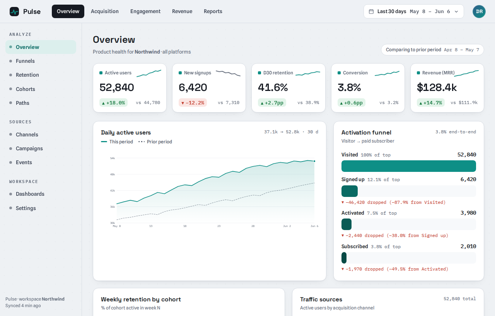
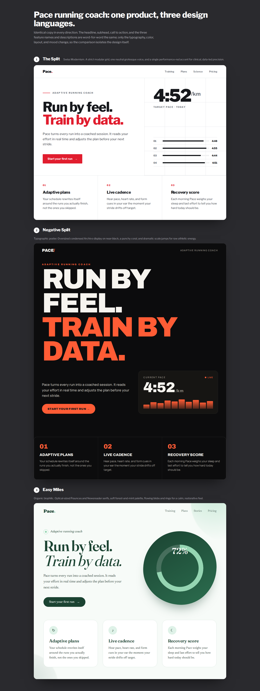
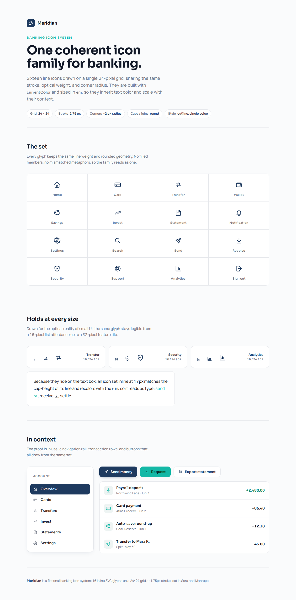
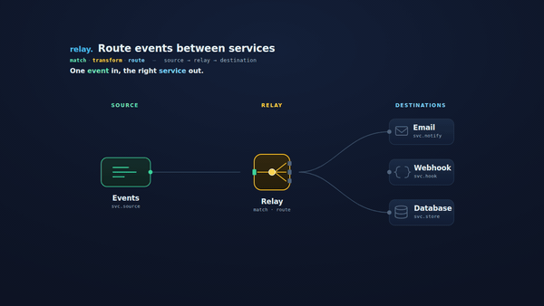

# atelier

**A repo-aware design studio that *governs* your design — it doesn't just generate pages.**

Most design tools (AI or otherwise) generate a pretty artifact and walk away.
atelier does the senior thing: it **measures** the design language already living
in your codebase, writes it down as an **enforceable contract** (`DESIGN.md` +
machine-readable tokens), and then makes every output — and every future change —
obey it. One bold, intentional aesthetic per project; never generic AI slop.

> The difference: pretty pages are table stakes. A design system that is
> *measured from your code, enforced in CI, audited for accessibility, and kept
> coherent over the product's lifetime* is the part a senior designer-engineer
> brings — and what atelier automates.

## Install

In Claude Code, add the marketplace and install the plugin:

```text
/plugin marketplace add BrunoVini/atelier
/plugin install atelier@atelier-dev
```

Then just ask for design work in any repo — atelier triggers on prototypes,
pages, components, slides, animations, previews, variants, reviews, layout scores,
"weigh the options", or "make it look good". The Python scripts use the stdlib
(no install needed); `screenshot.mjs` / `diff_screens.mjs` / `responsive_check.mjs`
and video export are optional and need Node + a headless browser.

## Gallery

Every artifact below was produced by atelier from a **one-line brief**, then put
through its own self-QA loop (slop / contrast / overlap / a11y / font-load) and
**fixed until clean** — no hand-tuning after the fact. One self-contained file each,
inline everything, no page builder.

<table>
<tr>
<td width="50%"><br><sub><b>Marketing landing</b> — an AI-agent control plane. Confident dark system, live run-graph, honest controls.</sub></td>
<td width="50%"><br><sub><b>Analytics dashboard</b> — KPI row, charts, and tables where every number reconciles and color is an encoding, not decoration.</sub></td>
</tr>
<tr>
<td><br><sub><b>Clickable iOS prototype</b> — real iPhone frame, 4 tap-navigable screens, ≥44px targets, boots offline (no CDN runtime).</sub></td>
<td><br><sub><b>Keynote deck</b> — a real slide engine + speaker notes, exportable to <b>vector PDF</b> and <b>editable PPTX</b> (real text frames).</sub></td>
</tr>
<tr>
<td><br><sub><b>Print infographic</b> — magazine typography, hand-built SVG charts, data that reconciles; exports to vector PDF.</sub></td>
<td><br><sub><b>Design directions</b> — 3 genuinely distinct, internally-coherent languages for one brief; same copy, design varies.</sub></td>
</tr>
<tr>
<td><br><sub><b>Cohesive icon set</b> — 16 icons on one grid/stroke/weight system, legible to 16px, <code>currentColor</code> + <code>&lt;use&gt;</code>.</sub></td>
<td><br><sub><b>SVG illustration</b> — a full-bleed hero scene with atmospheric depth, a lead-line to the focal point, and a copy plate.</sub></td>
</tr>
</table>

**Motion** — explainer animations export to MP4 **and** palette-optimized GIF:



### With the skill vs. without

Same brief, same model — left is vanilla Claude in isolation, right is the same model
using atelier. The skill steers away from the generic-AI defaults (violet gradient,
Inter, decorative color) and toward a measured, self-QA'd system:

<table>
<tr>
<td width="50%"><br><sub>⟵ <b>without atelier</b> — generic violet/teal + Inter, decorative accent</sub></td>
<td width="50%"><br><sub><b>with atelier</b> ⟶ owned palette, characterful type, honest live UI, zero slop tells</sub></td>
</tr>
</table>

## The core idea

Measure before you generate. The design already living in the repo wins over
anything invented from scratch. atelier works in three phases:

**MEASURE** the repo → **GENERATE** artifacts on-contract → **GOVERN** coherence over time.

And on *every* artifact — even from-scratch work with no repo to measure — it runs a
**self-QA loop and fixes what it flags** (slop, contrast, overlaps, overflow). That
mechanical verification of its own output is the delta a blank model can't reproduce.

## Everything atelier does

### MEASURE — understand the repo's real design first

- **Empirical DESIGN.md contract.** Clusters the real colors in your code
  (perceptual ΔE — incl. `oklch`/`lab`/`color-mix`), reads your fonts, spacing,
  radius, breakpoints, framework, and component library — from stylesheets,
  Tailwind classes / `tailwind.config` / **Tailwind v4 `@theme`**, `theme.ts`,
  CSS-in-JS, design-token custom properties, and across a **monorepo** — and
  writes a contract grounded in fact, not guesswork.
- **Honest about messes.** Grades a repo's consistency first; a coherent repo is
  auto-mapped, a chaotic one gets a per-dimension warning with the best options
  pre-selected for you to choose — it never writes a confident contract over chaos.
- **Thin contract when the repo owns its tokens.** When a TS theme / CSS-vars /
  Tailwind config already exists, DESIGN.md *points at it* instead of duplicating
  values (a second copy silently drifts).
- **Reference import (image or URL).** "Make it like this" — extracts colors, type,
  and spacing from a screenshot or a live site to seed a direction.
- **Frontend architecture survey + component census.** Maps the stack and catalogs
  your components/variants so output *reuses* them instead of reinventing.
- **Knowledge-grounded recommendations.** Palette, typography, named-style, product,
  and stack-idiomatic (react/next/shadcn/swiftui/flutter/rn) guidance — used to fill
  gaps when the scan is sparse, and for cold-start reasoning on greenfield work.

### GENERATE — produce artifacts that obey the contract

- **Hi-fi prototypes / app mockups / device frames**, real UI code written into an
  existing repo, and **2–3 distinct design directions** to choose from.
- **Themed live preview** — a local server that serves your output themed by your own
  tokens, with click-to-select, plus **live element iteration** (pick an element →
  contract-bound variants → accept back into source, with journaled undo).
- **Slides / decks / presentations.**
- **Animations / explainers / narrated video** (MP4·GIF, with motion best-practices,
  pitfalls, cinematic patterns, scene templates, and BGM), **scroll-driven motion**
  (pin/scrub, horizontal hijack, scroll-reveal), and **3D / shader / WebGPU heroes**
  fed by your tokens.
- **SVG** — icons, decorative shapes, diagrams, animated SVG.
- **Living style guide** page (swatches, type scale, spacing, component inventory).
- **Realistic content + empty/loading/error states** so mockups aren't lorem-ipsum.
- **Motion / interaction specs.**
- **Responsiveness that survives the tablet zone** — a width sweep (360→1920, incl.
  768–1024) so the mid-range stops breaking silently.
- **Multi-brand / dark-mode / white-label theming**, and **native theme handoff**
  (SwiftUI / Flutter / React Native).
- **i18n / RTL** logical-property linting.
- **Design planning + a 5-seat Design Council** (for / against / neutral / UX / craft
  → a synthesized verdict) for hard, multi-surface calls.

### GOVERN — keep it coherent, accessible, on-contract

- **Slop detector.** Scans generated HTML for the AI tells (generic fonts, purple
  gradient, gratuitous glassmorphism, chunky left-border cards) across three layers —
  visual, copy, structural. "No slop" is a *check*, not just a prompt.
- **Contrast audit.** Computes WCAG ratios for every text/surface pairing in the
  *locked palette* and suggests nearest-passing shades.
- **Overlap / collision hunting across screen sizes** — runs by default in any scan or
  review: text-on-text collisions and decoration-over-text (rendered), plus a static
  no-render risk lint for absolutely-positioned decorations and negative margins.
- **Design lint ("design ESLint").** Flags off-contract colors/fonts with
  file·line·severity·fix (perceptual, so near-duplicates don't false-positive).
- **House-rule enforcement** ("use a modal, never a flyout") — the repo's own rules
  are law and override atelier's defaults.
- **Critique / layout scoring, visual-regression diffing, and performance budgets.**
- **Token-migration codemod.** Rewrites hardcoded values to `var(--token)`, dry-run
  first, paired with visual-regression to prove "zero pixels moved".
- **Coherence score + design-debt report.** One 0–100 number, with hotspots and a
  trend you can put on a roadmap.
- **Design QA in CI.** A merge gate (GitHub Actions + Azure Pipelines templates) —
  design coherence enforced like tests — plus **PR design review** and **team
  onboarding packs**.

## How it works

The first time you do visual work in a repo with no `DESIGN.md`, atelier offers to
generate one by measuring your code, then exports tokens (only when no token source
already exists). Every later generation reads the contract and stays inside it; the
lint, contrast, overlap, and CI tools keep it that way.

## Quick start

```bash
python3 scripts/scan_repo.py <repo>                         # empirical design report
python3 scripts/assess.py <repo>                            # consistency: clean | minor | messy
python3 scripts/export_tokens.py tokens.json design         # tokens.css + preset + W3C json
python3 scripts/export_native.py <repo>                     # SwiftUI / Flutter / RN theme files
python3 scripts/lint_design.py <repo>                       # design lint (resolves DESIGN.md or json)
python3 scripts/audit_contrast.py <repo>                    # WCAG contrast audit
python3 scripts/check_rules.py <repo>                       # house rules ("no flyouts")
python3 scripts/check_rtl.py <repo>                         # i18n/RTL logical-property lint
python3 scripts/check.py <repo>                             # CI gate (lint + contrast + rules)
python3 scripts/design_report.py <repo>                     # coherence score -> DESIGN-DEBT.md
python3 scripts/slop_check.py page.html --contract <repo>   # AI-slop tells
python3 scripts/overlap_risk.py <repo>                      # static overlap-risk lint (no render)
python3 scripts/build_styleguide.py design/design-tokens.json   # living style guide
scripts/preview/start.sh --project-dir <repo>              # live preview server (free port)
node scripts/responsive_check.mjs page.html                # width sweep (tablet zone + overlaps)
node scripts/screenshot.mjs page.html shot.png             # capture for review/scoring
node scripts/diff_screens.mjs page.html                    # visual-regression diff
```

Routing for every capability is in `SKILL.md`; depth lives in `references/`.

## Development

```bash
pip install pytest              # (test dep; not bundled)
python3 -m pytest tests/ -v     # script test suite
```

## License

Apache-2.0 — see `LICENSE`.
