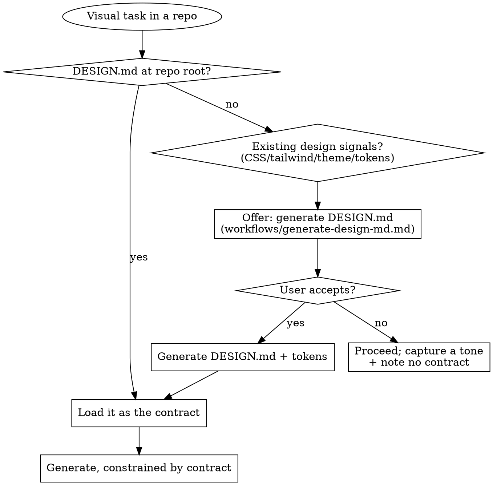

# atelier

A repo-aware design studio. atelier measures a project's real design language,
writes it down as an enforceable `DESIGN.md` (+ tokens), and then generates every
visual artifact — prototypes, components, slides, animations, live previews — so
they obey that one source of truth. One bold, intentional aesthetic per project;
never generic AI slop.

**Core principle:** Measure before you generate. The design already living in the
repo wins over anything invented from scratch.

## The DESIGN.md gate (read this first, every time)

Before producing ANY visual output in a repository, resolve the design contract.



<HARD-GATE>
Never invent a palette, font, or spacing scale while a repo already declares one
(in `DESIGN.md`, `tailwind.config`, a theme file, or CSS variables). Measure it
with `scripts/scan_repo.py` and obey it. If no contract exists, OFFER to generate
one before generating polished output — do not silently default to Inter +
purple gradient. This applies no matter how "quick" the request seems.

When the repo ALREADY owns its tokens (a TS/JS theme module, a CSS custom-property
theme, or a Tailwind config — `scan_repo` reports this as `token_source`), DESIGN.md
**points at that source**; do NOT create a parallel `design/` folder or re-transcribe
the token values — a second copy silently drifts. Generate `design/` tokens only when
there is no existing source (or the user explicitly asks for a portable mirror). Never
silently write to the user's tracked files (e.g. their `.gitignore`); keep scratch in
`/tmp`.

When generating a DESIGN.md, first ASSESS consistency (`scripts/assess.py`). If the
repo is **messy** (no dominant palette, mixed styling, duplicate components), do
NOT write a confident contract — warn the user honestly, present the best options
pre-selected, let them choose, then write. Auto-pick only when it's clean/minor.

Also OBEY the project's own rules in `DESIGN.md` when present: the **house rules**
(§9 — e.g. "use a modal, never a flyout"), the **component standards** (§7), and
the **data/chart standards** (§8) are LAW for this repo and OVERRIDE atelier's
defaults. They scale with the repo — a portfolio may have none; a large/design-
system repo will have many. Honor them when generating; `scripts/check_rules.py`
flags violations.
</HARD-GATE>

## Routing — pick the capability, then read its reference

Three phases: **MEASURE** the repo → **GENERATE** artifacts → **GOVERN** coherence.

### MEASURE — understand the repo's real design first
| The user wants… | Read | Key scripts |
|---|---|---|
| A DESIGN.md / design system / "map our design" | `references/workflows/generate-design-md.md` | `scan_repo.py`, `export_tokens.py` |
| Is the repo too inconsistent to auto-generate a contract? | `references/workflows/generate-design-md.md` | `assess.py` |
| "Make it like this" / import a reference / cold start | `references/workflows/generate-design-md.md` | `import_reference.py` |
| Survey the frontend architecture before writing code | `references/workflows/architecture-fit.md` | `survey_repo.py` |
| Reuse existing components / component inventory | `references/workflows/census.md` | `census.py` |
| Palette / font / style / product recommendations | `references/knowledge/` | `search_kb.py` |
| "Make it like Stripe/Linear/Notion…" (named brand) | `references/knowledge/` (brand-exemplars) | `search_kb.py` |
| Stack-idiomatic do/don't (react/next/shadcn/swiftui/flutter/rn) | `references/knowledge/` | `search_kb.py` |
| Greenfield with NO repo signal (cold start reasoning) | `references/workflows/generate-design-md.md` | `search_kb.py` (reasoning) |
| The design philosophy / why "no generic look" | `references/design-philosophy.md` | — |

### GENERATE — produce artifacts that obey the contract
| The user wants… | Read | Key assets / scripts |
|---|---|---|
| Plan a robust / multi-surface effort (redesign, rollout) | `references/workflows/design-plan.md` | contract + council |
| Write real UI code into an existing repo | `references/workflows/architecture-fit.md` | `survey_repo.py`, `census.py` |
| A hi-fi prototype / app mockup / device frame | `references/capabilities/prototypes.md` | `assets/frames/*.jsx` |
| A live preview / demo / "show me" / pick between options | `references/capabilities/preview.md` | `scripts/preview/start.sh` |
| 2-3 design directions to choose from | `references/capabilities/variants.md` | `assets/engines/canvas.jsx` |
| A hard call / "weigh the options" / decide a direction | `references/capabilities/council.md` | (5-agent council) |
| Slides / a deck / presentation | `references/capabilities/slides.md` | `assets/engines/deck.js` |
| An animation / explainer / narrated video / MP4·GIF | `references/capabilities/animations.md` (+ `capabilities/animation/`) | `assets/engines/narration.jsx`, `export_video.sh` |
| Scroll-driven motion (pin/scrub, horizontal hijack, scroll-reveal) | `references/capabilities/scroll-motion.md` | — |
| A 3D / shader / WebGPU / Three.js hero (delegate + feed tokens) | `references/capabilities/3d-hero.md` | (routes to `webgpu-threejs-tsl`) |
| Icons / decorative SVG / diagrams / animated SVG | `references/capabilities/svg.md` | `assets/engines/sprites.jsx` |
| A living style guide page (swatches, scale, components) | `references/workflows/generate-design-md.md` | `build_styleguide.py` |
| Realistic content / empty·loading·error states | `references/capabilities/content.md` | `seed_content.py` |
| A motion / interaction spec | `references/capabilities/motion-spec.md` | `export_tokens.py` |
| Make a layout work across screens / fix the tablet mid-range | `references/capabilities/responsive.md` | `responsive_check.mjs` |
| Multi-brand / dark mode / white-label theming | `references/workflows/cross-platform.md` | `export_tokens.py` |
| Native theme handoff (SwiftUI / Flutter / React Native) | `references/workflows/cross-platform.md` | `export_native.py` |
| i18n / RTL support | `references/capabilities/i18n-rtl.md` | `check_rtl.py` |

### GOVERN — keep it coherent, accessible, on-contract
| The user wants… | Read | Key scripts |
|---|---|---|
| A critique / review / score a layout / "is this good?" | `references/capabilities/review.md` | `screenshot.mjs` |
| Audit accessibility / contrast against the palette | `references/capabilities/review.md` | `audit_contrast.py` |
| Verify output isn't generic AI slop | `references/capabilities/review.md` | `slop_check.py` |
| Verify a change didn't regress (visual diff) | `references/capabilities/review.md` | `diff_screens.mjs` |
| Hunt overlaps/collisions across screen sizes (default in any scan/review) | `references/capabilities/review.md` | `responsive_check.mjs`, `overlap_risk.py` |
| A performance / weight budget for a page | `references/capabilities/review.md` | `perf_budget.py` |
| Check the repo doesn't drift from DESIGN.md (design lint) | `references/workflows/enforce-coherence.md` | `lint_design.py` |
| Enforce project house rules ("no flyouts, only modals") | `references/workflows/enforce-coherence.md` | `check_rules.py` |
| Migrate hardcoded values to tokens (codemod) | `references/workflows/enforce-coherence.md` | `migrate_to_tokens.py` |
| A design-debt report / coherence score / trend | `references/workflows/design-debt.md` | `design_report.py` |
| Gate design in CI / pre-commit | `references/workflows/ci.md` | `check.py` |
| Design-review a pull request | `references/workflows/pr-review.md` | `lint_design.py` |
| Onboard the team to the design language | `references/workflows/onboarding.md` | `build_onboarding.py` |

## Quick start

```bash
# Measure the repo's real design language (prints a JSON report)
python3 scripts/scan_repo.py /path/to/repo

# Turn a token dict into enforceable artifacts (design/tokens.css, etc.)
python3 scripts/export_tokens.py tokens.json

# Open a live, click-to-select preview server (run in background)
scripts/preview/start.sh --project-dir /path/to/repo
```

## Red flags — STOP, you are rationalizing

| Thought | Reality |
|---|---|
| "It's quick, no need for DESIGN.md" | "Quick" is exactly when design drifts. Checking takes seconds. |
| "I'll use Inter / a purple gradient to move fast" | That is the AI slop atelier exists to prevent. Use the contract. |
| "This repo has no defined design" | `scan_repo.py` measures what already exists. Measure before inventing. |
| "The user just wants suggestions, skip the preview" | Suggestions are exactly when a live preview helps — open it (preview.md). |
| "I'll show one option, that's enough" | When the user is choosing a direction, show variants side by side. |
| "Tokens are overkill, prose is fine" | Prose can't be enforced. Export tokens so the contract lives in code. |

## Conventions

- This skill and its references are written in **English**. Output (the artifacts
  you generate, copy, narration) follows the **user's language and request**.
- Progressive disclosure: this file routes; depth lives in `references/`. Read the
  one reference you need — don't preload everything.
- **User-facing voice:** internal scaffolding is for you, not the user. Never
  surface section numbers (`§2`, `§9`), script names, or file paths in what you say
  to the user — refer to things by plain name ("house rules", "the palette", "the
  design contract", "the style guide"). The user shouldn't see atelier's internals.
