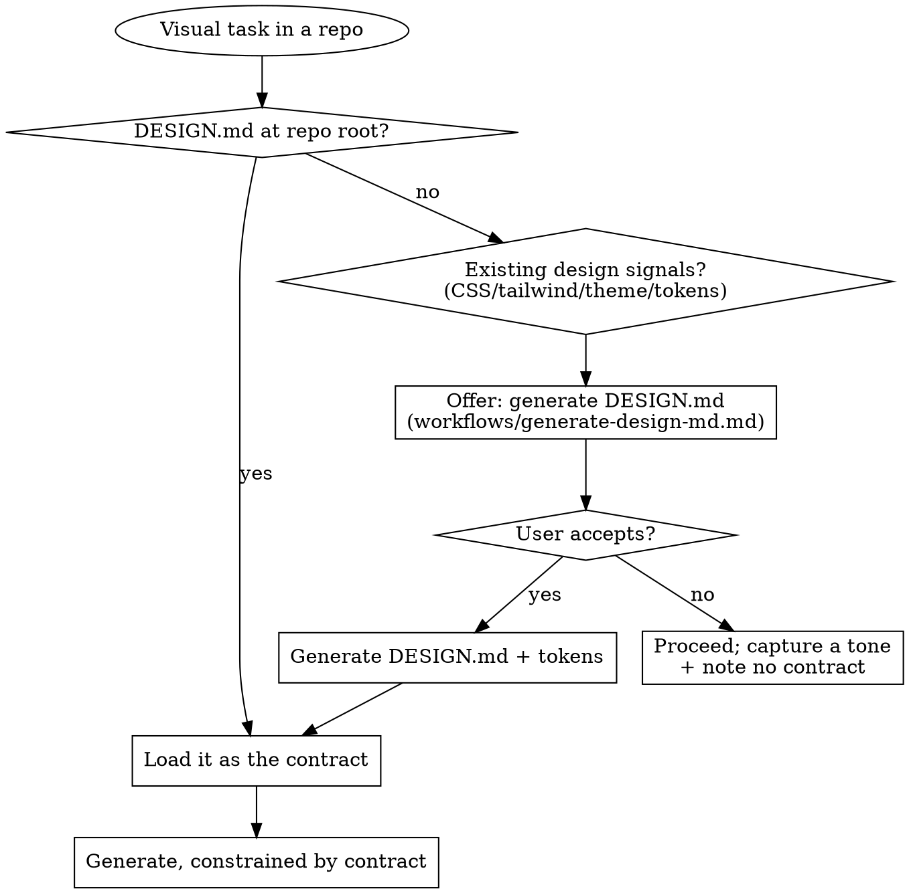

# atelier

A repo-aware design studio. atelier measures a project's real design language,
writes it down as an enforceable `DESIGN.md` (+ tokens), and then generates every
visual artifact — prototypes, components, slides, animations, live previews — so
they obey that one source of truth. One bold, intentional aesthetic per project;
never generic AI slop.

**Core principle:** Measure before you generate. The design already living in the
repo wins over anything invented from scratch.

## The DESIGN.md gate (read this first, every time)

Before producing ANY visual output in a repository, resolve the design contract.



<HARD-GATE>
Never invent a palette, font, or spacing scale while a repo already declares one
(in `DESIGN.md`, `tailwind.config`, a theme file, or CSS variables). Measure it
with `scripts/scan_repo.py` and obey it. If no contract exists, OFFER to generate
one before generating polished output — do not silently default to Inter +
purple gradient. This applies no matter how "quick" the request seems.
</HARD-GATE>

## Routing — pick the capability, then read its reference

| The user wants… | Read | Key assets / scripts |
|---|---|---|
| A DESIGN.md / design system / "map our design" | `references/workflows/generate-design-md.md` | `scripts/scan_repo.py`, `scripts/export_tokens.py` |
| A live preview / demo / "show me" / pick between options | `references/capabilities/preview.md` | `scripts/preview/start.sh` |
| A hi-fi prototype / app mockup / device frame | `references/capabilities/prototypes.md` | `assets/frames/*.jsx` |
| Slides / a deck / presentation | `references/capabilities/slides.md` | `assets/engines/deck.js` |
| An animation / explainer / narrated video / MP4·GIF | `references/capabilities/animations.md` | `assets/engines/narration.jsx`, `scripts/export_video.sh` |
| 2-3 design directions to choose from | `references/capabilities/variants.md` | `assets/engines/canvas.jsx` |
| A critique / review / score a layout / "is this good?" | `references/capabilities/review.md` | `scripts/screenshot.mjs` |
| A hard call / "weigh the options" / decide a direction | `references/capabilities/council.md` | (5-agent council) |
| Check the repo doesn't drift from DESIGN.md | `references/workflows/enforce-coherence.md` | `scripts/scan_repo.py` |
| The same design across web + mobile + slides | `references/workflows/cross-platform.md` | `scripts/export_tokens.py` |
| The design philosophy / why "no generic look" | `references/design-philosophy.md` | — |
| Palette / font / product-type recommendations | `references/knowledge/` | `scripts/search_kb.py` |

## Quick start

```bash
# Measure the repo's real design language (prints a JSON report)
python3 scripts/scan_repo.py /path/to/repo

# Turn a token dict into enforceable artifacts (design/tokens.css, etc.)
python3 scripts/export_tokens.py tokens.json

# Open a live, click-to-select preview server (run in background)
scripts/preview/start.sh --project-dir /path/to/repo
```

## Red flags — STOP, you are rationalizing

| Thought | Reality |
|---|---|
| "It's quick, no need for DESIGN.md" | "Quick" is exactly when design drifts. Checking takes seconds. |
| "I'll use Inter / a purple gradient to move fast" | That is the AI slop atelier exists to prevent. Use the contract. |
| "This repo has no defined design" | `scan_repo.py` measures what already exists. Measure before inventing. |
| "The user just wants suggestions, skip the preview" | Suggestions are exactly when a live preview helps — open it (preview.md). |
| "I'll show one option, that's enough" | When the user is choosing a direction, show variants side by side. |
| "Tokens are overkill, prose is fine" | Prose can't be enforced. Export tokens so the contract lives in code. |

## Conventions

- This skill and its references are written in **English**. Output (the artifacts
  you generate, copy, narration) follows the **user's language and request**.
- Progressive disclosure: this file routes; depth lives in `references/`. Read the
  one reference you need — don't preload everything.
